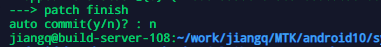
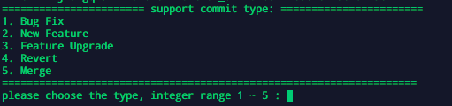
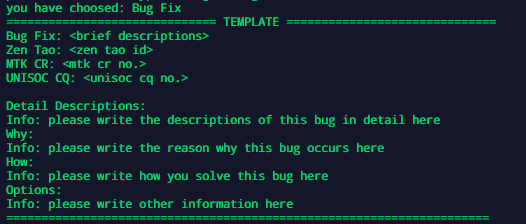
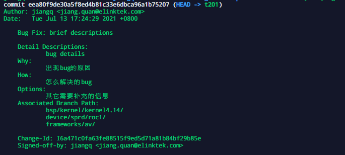

# hotfix使用说明

Verison:1.1															Date：2021-07-20

[TOC]

---


## 文档修改记录

|    Date    | Version | Change List  | Modified By |
| :--------: | :-----: | :----------: | :---------: |
| 2021-07-13 |   1.0   |   新建文档   |    蒋权     |
| 2021-07-20 |   1.1   | 增加错误说明 |    蒋权     |
|            |         |              |             |


## 适用范围

**平台：**MTK 平台，展锐平台和RK 平台 android代码

## 功能

1. hotfix： 备份当前repo仓库所有代码修改
2. commit： 提交代码到本地分支

## 使用说明

### hotfix

默认运行脚本不带参数，可以将文件改动提取出来分别存在**before**和 **after** 文件夹下。

注意，hotfix 完成后不需要提交要输入 **n** 或 **no**



运行完成后存档文件为 .repo 所在目下:`PATCH/<branch_name>/Patch_<hotfix_date>`


### commit

>  commit 功能为 在 hotfix 功能上的第二步，用于提交当前**所有** hotfix 找出的改动。

**auto commit(y/n)? : ** 输入 **y/yes**进入代码提交流程

#### 无模板提交/初次提交

**提交代码步骤：**

1. 按照提示选择需要提交代码的问题种类，输入起始数字标号即可

   

   目前支持的提交种类如上图，**暂时不在提交选项范围内的提交应当不提交至服务器。**

2. 输入对应数字后会在工程 **.repo** 目录同级目录下生成  **commit.txt** 文件。

   注意：所有提交信息都要写在 commit.txt 文件中。如果当前没有 commit.txt 文件则会自动生成一个 commit.txt 文件，包含提交模板信息。

   如 Bug Fix 选项模板如下

   

   

3. 更改好后 commit.txt 文件，在等待框中按提示输入 y

4. 检查读取的 commit.txt 文件信息是否和自己更改的一致。如果一致，按提示输入 y

5. 提交成功。


#### 有模板提交

> 当前工程 .repo 目录下已经有写好的 commit.txt 文件适用

**提交代码步骤：**

​	系统会自动读取 当前提交模板中的 commit.txt 文件，并显示，确认无误后按照提示按y既可以提交代码。

#### 中断提交

​     在任意提示确认框中输入**n** 即可中断提交过程。


## commit.txt 文件说明

```txt
1. Bug Fix: <brief descriptions>
2. Zen Tao: <zen tao id>
3. MTK CR: <mtk cr no.>
4. UNISOC CQ: <unisoc cq no.>

5. Detail Descriptions:
        Info: please write the descriptions of this bug in detail here
6. Why:
        Info: please write the reason why this bug occurs here
7. How:
        Info: please write how you solve this bug here
8. Options:
        Info: please write other information here
```

1. Bug Fix: 提交模板头，自动生成固定格式，分别对应提交代码种类，后面接的 brief 为**必填项**

   > 提交模板头有 Bug Fix, New Feature, Feature Upgrade, Revert, Merge

2. Zen Tao: 对应禅道问题的对应编号，如无写 n或no
3. MTK CR: 对MTK CR 问题的对应编号，如无写 n或no
4. UNISOC CQ: 对展锐CQ 问题的对应编号，如无写 n或no
5. Detail Descriptions: 问题详细描述，**必填项**
6. Why:  出现现象的原因
7. How: 解决了什么问题或者做了什么操作
8. Options: 补充信息或者测试信息


### 提交后 git log 信息说明



对比 自己编写的 commit.txt 文件，多出的选项含义

Associated Branch Path:

> 当前提交所有有修改的git 仓库路径，在提交的任意仓库均能看到所有的提交仓库信息


## 错误解释说明

### format check failed

```txt
some message didn't write, please re-check commit message. 
        Info: please write the descriptions of this bug in detail here

--->>> error: /mnt/hd1/jiangq/MTK/android10/sy828_driver/commit.txt format check failed!!!
```

>  提交模板文件 格式检查错误，对应项目错误


### ERROR: Platform Detected

> 运行hotfix 目录错误，运行hotfix 目录为 MTK 为 alps 目录内，其它平台为源码 **.repo**  文件对应目录

